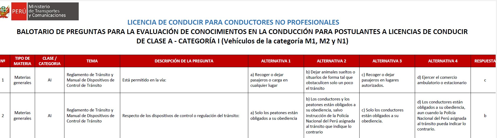
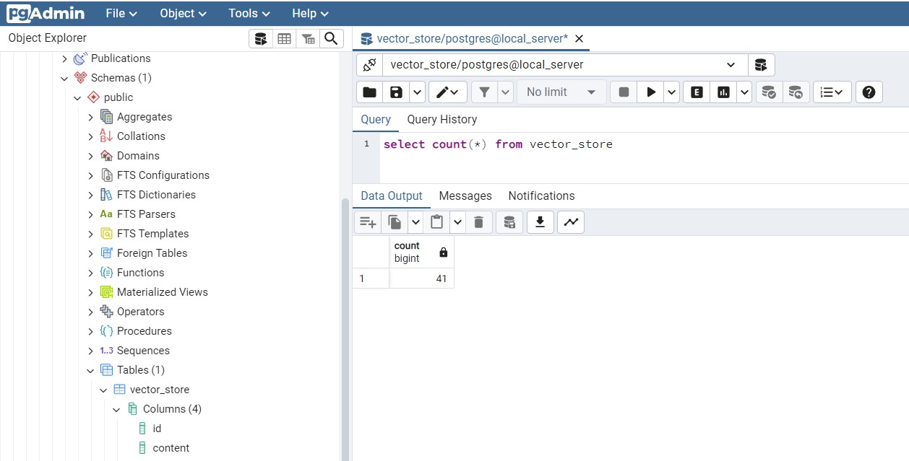

# ChatBot con OpenAI

### Finalidad
Este proyecto muestra como se puede utilizar OpenAI para generar un chatbot
que puede responder con información proveida desde un PDF.

Se utiliza una base de datos postgresql e información publicada en el MTC.

La idea es procesar el PDF del balotario de preguntas del MTC para luego realizar preguntas
en base a dicha información.

### Requerimientos:
- Key de OpenAI, se obtiene de la siguiente URL: https://platform.openai.com/api-keys
- Maven 3.8+
- Jdk 17+
- Spring 3.2+
- Springframework AI 0.8.0-SNAPSHOT

### Imagenes de Demo
Datos a cargar para el chatbot

Obtención del key de acceso a OpenAI, se puede hacer con una cuenta nueva, o recargar.

Saldo en la cuenta activa.

Levantar los servicios con docker-compose:

Verificar los servicios de bd:

Activar las lineas de Setup y ejecutar programa.

Contar los registros de bd para verificar la carga de data. Luego comentar las lineas de setUp()

Visualizar la data con un Query SQL a BD vector_store;

Ejemplo de invocación desde postman;

Verificación de datos en el PDF.;

### Reference Documentation
For further reference, please consider the following sections:

* [OpenAI Chat](https://docs.spring.io/spring-ai/reference/api/clients/openai-chat.html)

### Guides
The following guides illustrate how to use some features concretely:
* [Spring AI Provides Integration with OpenAI and Azure OpenAI](https://www.infoq.com/news/2023/08/spring-ai/)

